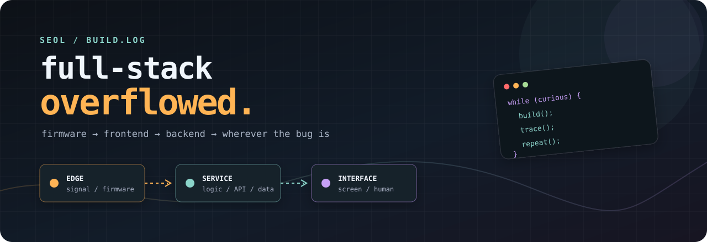
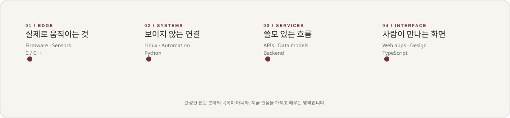

<div align="center">
  <a href="https://github.com/codenameseol">
    
  </a>
</div>

<div align="center">
  <a href="https://github.com/codenameseol?tab=repositories">
    
  </a>
  
  
</div>

<br />

## junior but overstacked.

Hi, I’m **Seol** — a junior builder who likes following an idea all the way down to the metal, then all the way back to the screen.

I’m interested in the whole path: a signal becomes firmware, firmware speaks a protocol, a service turns it into something useful, and an interface makes it feel obvious. I’m still early in the journey; that is exactly why I’m deliberately touching every layer.

> I don’t want to be the person who only owns one box in the diagram.  
> I want to understand the hand-offs between all of them.

<div align="center">
  
</div>

## the stack I’m growing into

<table>
  <tr>
    <td width="25%" valign="top">
      <strong>01 / edge</strong><br /><br />
      Firmware<br />
      Microcontrollers<br />
      Sensors &amp; protocols<br />
      C / C++
    </td>
    <td width="25%" valign="top">
      <strong>02 / systems</strong><br /><br />
      Linux<br />
      Networking<br />
      Python tooling<br />
      Automation
    </td>
    <td width="25%" valign="top">
      <strong>03 / services</strong><br /><br />
      APIs<br />
      Data models<br />
      Backends<br />
      Reliability
    </td>
    <td width="25%" valign="top">
      <strong>04 / interface</strong><br /><br />
      TypeScript<br />
      Web apps<br />
      Design systems<br />
      Human details
    </td>
  </tr>
</table>

<p>
  
  
  
  
  
</p>

## operating principles

- **Trace the whole signal.** A UI bug can start in a database, a wire, or an assumption.
- **Make small things real.** A tiny working prototype teaches more than a perfect diagram.
- **Keep the seams visible.** Good systems make boundaries explicit, testable, and easy to change.
- **Stay beginner-shaped.** Curiosity scales better than pretending to know everything.

## now / next

```text
now  → building small, complete systems and learning in public
next → more embedded work, better services, calmer interfaces
always → follow the bug until the layer changes
```

<div align="center">
  <sub>Made with curiosity, traces, and an unreasonable number of tabs.</sub>
</div>
